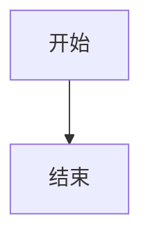

# TipTap Vue Mermaid Plugin

一个基于 Vue 3 的 TipTap Mermaid 插件，支持编辑和查看两种模式。

## 功能特性

- **双模式支持**：编辑模式和查看模式
- **实时预览**：编辑时实时渲染 Mermaid 图表
- **错误处理**：显示 Mermaid 语法错误
- **序列化支持**：正确序列化为 Mermaid DSL 文本
- **响应式设计**：编辑模式下左右分栏布局

## 安装

```bash
npm install mermaid
```

## 使用方法

### 在 TipTap 编辑器中集成

```javascript
import { Editor } from '@tiptap/core'
import VueMermaid from './tiptap-ext-vue-mermaid/src/index.ts'

const editor = new Editor({
  extensions: [
    // 其他扩展...
    VueMermaid,
  ],
})

// 插入 Mermaid 图表
editor.chain().focus().insertVueMermaid('graph TD\n    A[开始] --> B[结束]').run()
```

### 默认内容

插入的 Mermaid 图表包含默认的示例内容：



## 组件结构

### VueMermaid.vue

主要的 Vue 组件，包含：

- **查看模式**：显示渲染的 Mermaid 图表
- **编辑模式**：左右分栏，左侧预览，右侧编辑
- **工具栏**：编辑/查看切换按钮和删除按钮

### index.ts

TipTap 扩展定义，包含：

- 节点定义和属性
- 命令注册
- HTML 序列化/反序列化
- Vue 组件渲染器

## API

### 节点属性

- `content`: Mermaid DSL 文本内容
- `isEditing`: 是否处于编辑模式

### 命令

- `insertVueMermaid(content?)`: 插入 Mermaid 图表

## 样式定制

组件使用 CSS 变量和类名，可以通过以下方式定制样式：

```css
.vue-mermaid {
  /* 主容器样式 */
}

.mermaid-diagram {
  /* 图表容器样式 */
}

.mermaid-edit {
  /* 编辑模式样式 */
}
```

## 注意事项

1. 需要安装 `mermaid` 依赖
2. 组件会自动处理 Mermaid 的初始化和渲染
3. 编辑模式下的实时预览有 500ms 的防抖延迟
4. 每个图表实例都有唯一的 ID 以避免冲突
